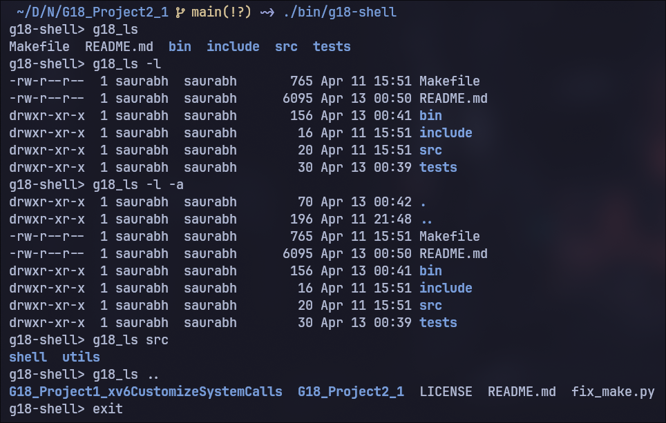
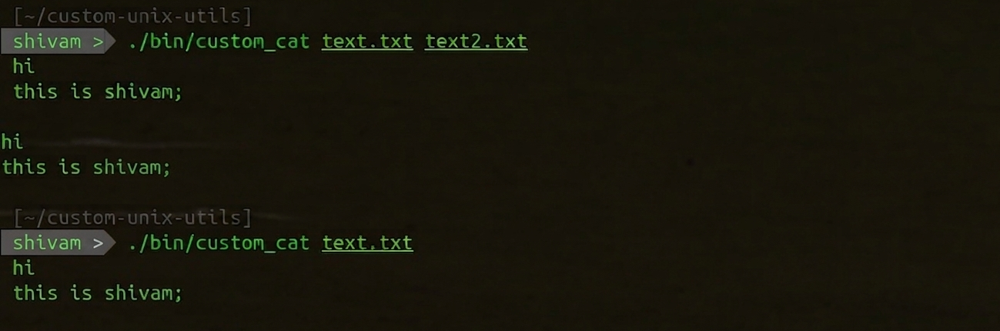
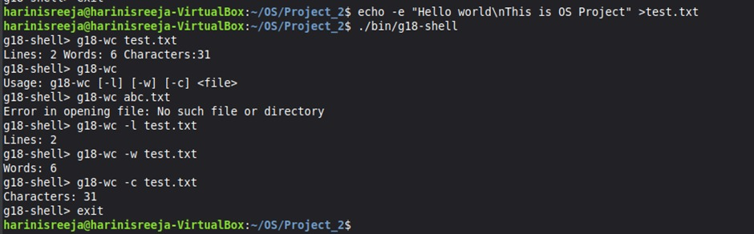
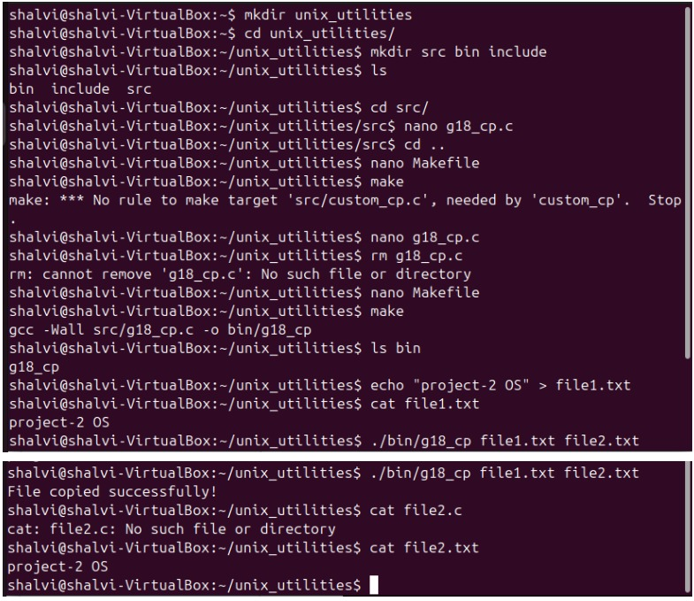
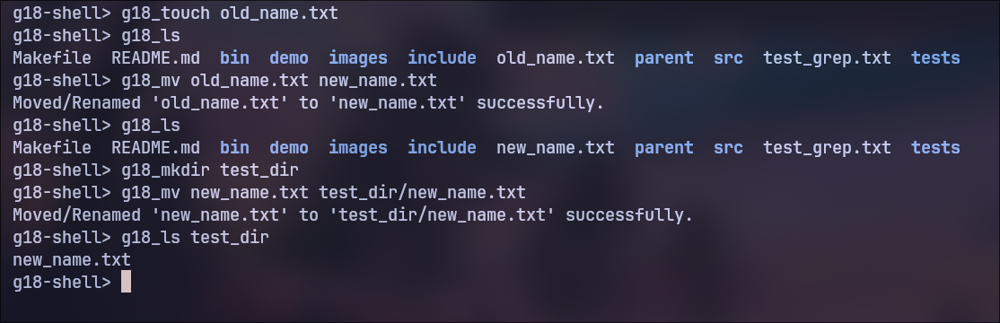
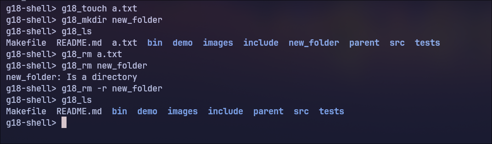
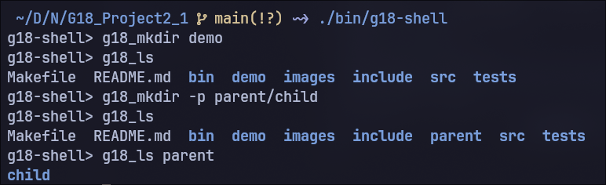
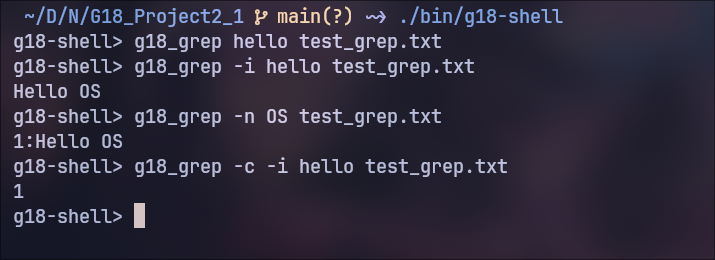

# G18 Project 2: UNIX-like Mini Shell and Utilities

## 1. Project Overview

This project implements a lightweight UNIX-like shell and a set of custom file/text utilities in C.

The shell prompt is:

`g18-shell>`

Each command runs as an external executable from the `bin/` directory.

## 2. Objectives

1. Build a working shell that accepts user commands and executes utilities.
2. Implement common UNIX-style commands from scratch in C.
3. Keep the build process simple and reproducible using `make`.
4. Maintain a clean source layout for team development.

## 3. Build and Run

### Build all binaries

```bash
make
```

### Run shell

```bash
./bin/g18-shell
```

### Clean build outputs

```bash
make clean
```

Notes:
1. `make` auto-compiles every `.c` file inside `src/utils/` into `bin/`.
2. If old binaries are present, run `make clean` before rebuilding.

## 4. Project Structure

```text
G18_Project2_1/
├── Makefile
├── README.md
├── include/
│   └── common.h
├── src/
│   ├── shell/
│   │   └── main_shell.c
│   └── utils/
│       ├── g18_cat.c
│       ├── g18_cp.c
│       ├── g18_grep.c
│       ├── g18_ls.c
│       ├── g18_mkdir.c
│       ├── g18_mv.c
│       ├── g18_rm.c
│       ├── g18_touch.c
│       └── g18_wc.c
├── bin/                 # Generated binaries
└── tests/
```

## 5. Shell Design

File: `src/shell/main_shell.c`

Features:
1. Shows prompt `g18-shell>`.
2. Reads one command line from `stdin`.
3. Splits command and arguments by spaces.
4. Supports built-in `exit`.
5. Uses `fork()` + `execv()` to run utilities from `./bin/<command>`.
6. Parent process waits for child completion using `wait()`.

## 6. Implemented Utilities

All utilities are implemented and available in `src/utils/`.

### 6.1 g18_ls

File: `src/utils/g18_ls.c`

Purpose:
The `ls` utility is used to list directory contents.

Features:
- Includes hidden files with `-a` option.
- Shows long listing format with `-l` option.

Usage:
```bash
g18_ls [-a] [-l] [directory]
```

Implementation Details:
- Uses `scandir()` with `alphasort` for ordered output.
- Uses `lstat()` for metadata in long mode.
- Shows colored directory names.

### g18_ls Screenshot



### 6.2 g18_cat

File: `src/utils/g18_cat.c`

Purpose:
The `cat` utility is used to display the contents of a file. It can also optionally display line numbers for each line.

Features:
- Displays contents of one or more files.
- Supports optional argument `-n` to show line numbers.
- Reads from standard input if no file is provided.

Usage:
```bash
g18_cat file.txt
g18_cat -n file.txt
g18_cat file1.txt file2.txt
```

Implementation Details:
- Uses `fgets()` for line-by-line reading when line numbering is enabled.
- Uses `fread()` and `fwrite()` for efficient block-based copying otherwise.
- Supports multiple files by iterating through command-line arguments.
- Falls back to standard input if no file is specified.

### g18_cat Screenshot



### 6.3 g18_wc

File: `src/utils/g18_wc.c`

Purpose:
The `wc` utility is used to count lines, words, and characters in a specified file.

Features:
- Shows line count only with `-l` option.
- Shows word count only with `-w` option.
- Shows character count only with `-c` option.

Usage:
```bash
g18_wc [-l] [-w] [-c] <file>
```

Implementation Details:
- If no flag is given, prints all three counts.
- Uses simple whitespace boundary logic for words.

### g18_wc screenshot



### 6.4 g18_touch

File: `src/utils/g18_touch.c`

Purpose:
The `touch` utility is used to create a new file if it does not exist or update the access and
modification timestamps of an existing file.

Features:
- Creates files if they do not exist.
- Updates file timestamps using system calls.

Usage:
```bash
g18_touch file.txt
g18_touch file1.txt file2.txt
```

Implementation Details:
- Uses `open()` with `O_CREAT` flag to create files if they do not exist.
- Uses `utime()` to update file timestamps.
- Iterates through all provided file arguments.
- Handles errors using `perror()`.

### g18_touch Screenshot


### 6.5 g18_cp

File: `src/utils/g18_cp.c`

Purpose:
The `cp` utility is used to copy a source file to a destination file.

Features:
- Copies file contents byte by byte.

Usage:
```bash
g18_cp <source_file> <destination_file>
```

Implementation Details:
- Opens source in read mode and destination in write mode.
- Copies data byte by byte using `fgetc()` and `fputc()`.

### g18_cp screenshot



### 6.6 g18_mv

File: `src/utils/g18_mv.c`

Purpose:
The `mv` utility is used to move or rename a file.

Features:
- Moves or renames the specified file to the destination path.

Usage:
```bash
g18_mv <source> <destination>
```

Implementation Details:
- Uses `rename()` for the move/rename operation.

### g18_mv Screenshot



### 6.7 g18_rm

File: `src/utils/g18_rm.c`

Purpose:
The `rm` utility is used to remove files and directories.

Features:
- Allows directory removal with `-r` option.

Usage:
```bash
g18_rm [-r] <path...>
```

Implementation Details:
- Tries `unlink()` first.
- If `-r` is set, attempts `rmdir()` for directory paths.

### g18_rm Screenshot



### 6.8 g18_mkdir

File: `src/utils/g18_mkdir.c`

Purpose:
The `mkdir` utility is used to create one or more directories.

Features:
- Creates parent directories as needed with `-p` option.

Usage:
```bash
g18_mkdir [-p] <directory...>
```

Implementation Details:
- Normal mode uses `mkdir(path, 0777)`.
- `-p` mode creates intermediate directories safely.

### g18_mkdir screenshot



### 6.9 g18_grep

File: `src/utils/g18_grep.c`

Purpose:
The `grep` utility is used to search for a pattern in one or more files.

Features:
- Supports case-insensitive search with `-i` option.
- Prints line numbers with `-n` option.
- Prints match count only with `-c` option.
- Inverts match with `-v` option.

Usage:
```bash
g18_grep [-i] [-n] [-c] [-v] <pattern> <file...>
```

Implementation Details:
- Supports single-file and multi-file output formatting.
- Returns exit code `0` if at least one match is found, otherwise `1`.

### g18_grep Screenshot



## 7. Error Handling Approach

1. Invalid usage prints a usage message.
2. File and directory failures report system errors (`perror` or equivalent messages).
3. Shell prints a clear message if command is not found in `./bin/`.