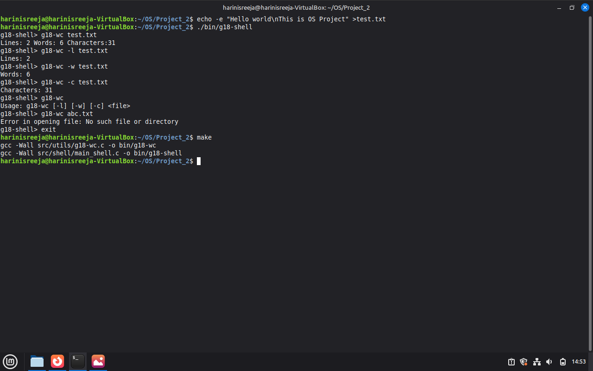

# G18 UNIX Utilities Project

## Overview
This project implements a simplified UNIX utility using C.  
The command implemented is `g18-wc`, which counts the number of lines, words, and characters in a file.

A custom shell `g18-shell` is also created to execute the command.

---

## Project Structure

Project_2/
├── bin/
├── include/
│   └── common.h
├── src/
│   ├── shell/
│   │   └── main_shell.c
│   └── utils/
│       └── g18-wc.c
├── Makefile
└── README.md

---

## Compilation

Run the following command:

make

---

## Execution

Run the shell:

./bin/g18-shell

Then execute:

g18-wc <filename>

---

## Features

- Counts:
  - Lines
  - Words
  - Characters
- Supports flags:
  - -l → line count
  - -w → word count
  - -c → character count
- Uses getopt() for parsing arguments
- Handles errors using perror()

---

## Sample Output

g18-shell> g18-wc test.txt  
Lines: 2 Words: 6 Characters: 31  

g18-shell> g18-wc -l test.txt  
Lines: 2  

g18-shell> g18-wc -w test.txt  
Words: 6  

g18-shell> g18-wc -c test.txt  
Characters: 31  

---

## Error Handling

- No arguments:
Usage: g18-wc [-l] [-w] [-c] <file>

- Invalid file:
Error opening file

---

## Technologies Used

- C Programming
- GCC Compiler
- Linux (Linux Mint)

---

## Screenshots

###Output

---

## Conclusion

This project demonstrates file handling, argument parsing, and implementation of UNIX-like utilities in C.
